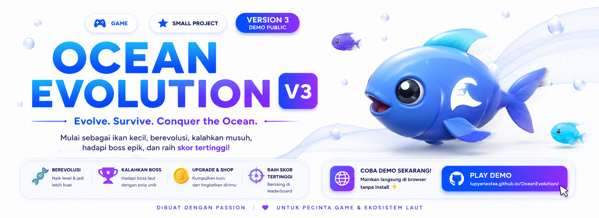
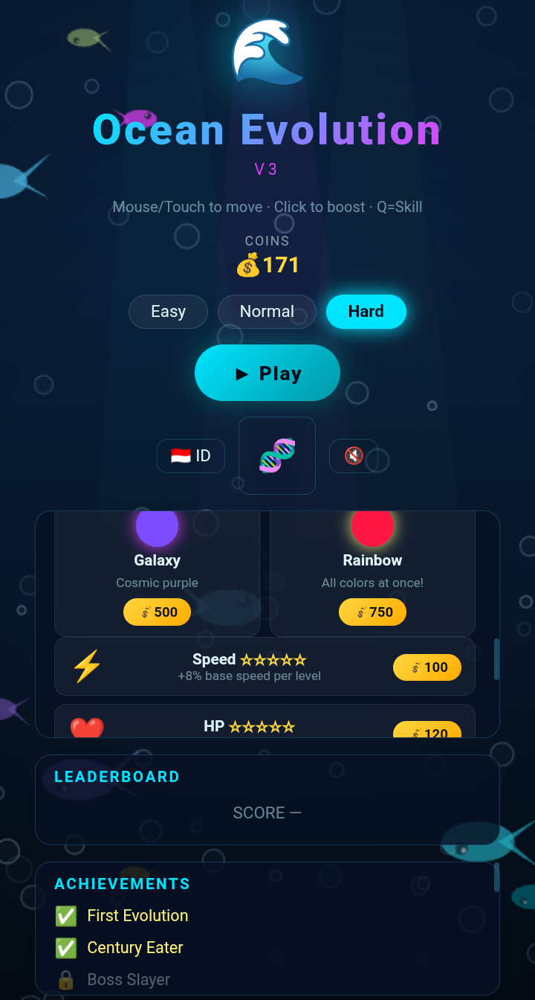

  

<h1 align="center">🌊 OceanEvolution</h1>

<b>Eat • Evolve • Survive</b>

OceanEvolution is an interactive 2D browser game where players evolve by eating smaller fish, avoiding dangerous predators, and surviving in the underwater world.

---

# 📷 Preview

---

# 🎮 Gameplay

OceanEvolution is a browser-based evolution game.

Your mission:

- 🐟 Eat smaller fish
- ⚠️ Avoid dangerous predators
- ⭐ Gain experience
- 🧬 Unlock new evolutions
- 👑 Become the king of the ocean

---

# ✨ Features

| Feature | Status |
|---------|:------:|
| Fish Evolution | ✅ |
| Enemy AI | ✅ |
| Responsive UI | ✅ |
| Multiple Fish Species | ✅ |
| Ocean Environment | ✅ |
| Sound Effects | ✅ |
| Public Demo | ✅ |
| Shop System | 🚧 |
| Save Progress | 🚧 |
| Boss Battle | 📅 |

---

# 🛠 Built With

| Technology | Description |
|------------|-------------|
| HTML5 | Game Structure |
| CSS3 | User Interface |
| JavaScript | Game Logic |
| GitHub Pages | Web Hosting |

---

# 🗺 Roadmap

| Version | Status | Description |
|----------|:------:|-------------|
| V1.0 | ✅ | Initial Prototype |
| V2.0 | ✅ | Gameplay Improvements |
| V3.0 | ✅ | Public Demo |
| V4.0 | 🚧 | More Fish, Better AI, Shop |
| V5.0 | 📅 | Boss Battle & Save System |

---

# 📜 Changelog

## 🌊 V3.0 - Public Demo

- Added Evolution System
- Improved Gameplay
- Better UI
- Better Performance
- Bug Fixes

---

## 🐟 V2.0

- Added More Fish
- Improved Controls
- Better Collision Detection

---

## 🐣 V1.0

- Initial Prototype
- Basic Movement
- First Playable Version

---

# 🌍 Play Online

🎮 https://lupyariestaa.github.io/OceanEvolution/

---

# 👨‍💻 Developer

**Lupy Ariesta**

Software Developer • Game Developer

Made with ❤️ in Indonesia 🇮🇩
